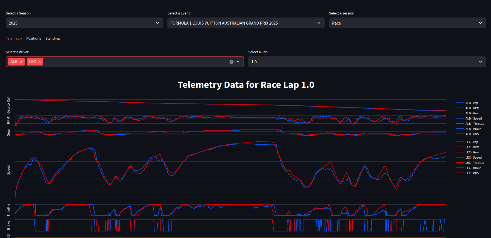
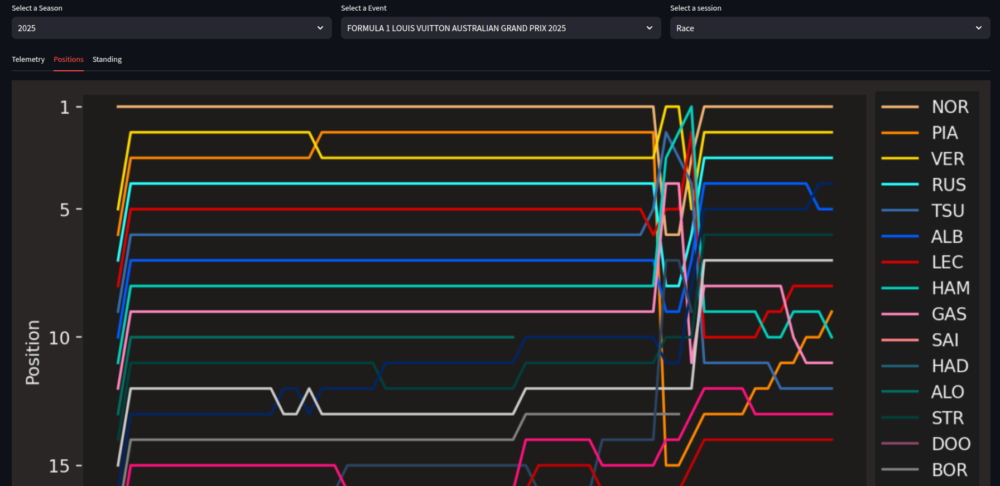

# F1 Telemetry Viewer

F1 Telemetry Viewer é uma aplicação desenvolvida em Python para visualizar dados de telemetria dos pilotos da Fórmula 1 em cada corrida. O projeto utiliza a biblioteca FastF1 para obter dados em tempo real e diversas ferramentas para análise e visualização interativa.

## Tecnologias Utilizadas

- [Streamlit](https://streamlit.io/) - Interface interativa para visualização de dados
- [FastF1](https://github.com/theOehrly/Fast-F1) - Biblioteca para acessar dados de telemetria da F1
- [Pandas](https://pandas.pydata.org/) - Manipulação de dados
- [NumPy](https://numpy.org/) - Cálculos matemáticos
- [Matplotlib](https://matplotlib.org/) - Visualização de dados em gráficos
- [Plotly](https://plotly.com/) - Gráficos interativos

## Como Rodar o Projeto

1. Clone este repositório:
   ```sh
   git clone https://github.com/seuusuario/f1-telemetry-viewer.git
   cd f1-telemetry-viewer
   ```

2. Instale as dependências:
   ```sh
   pip install -r requirements.txt
   ```

3. Execute a aplicação:
   ```sh
   streamlit run Menu.py
   ```

## Capturas de Tela

### Telemetria


### Posições


## Funcionalidades
- Seleção de temporada, evento e sessão da corrida
- Comparação de dados de telemetria entre pilotos
- Visualização de posições dos pilotos ao longo da corrida

## Contribuição
Contribuições são bem-vindas! Sinta-se à vontade para abrir issues e pull requests.

